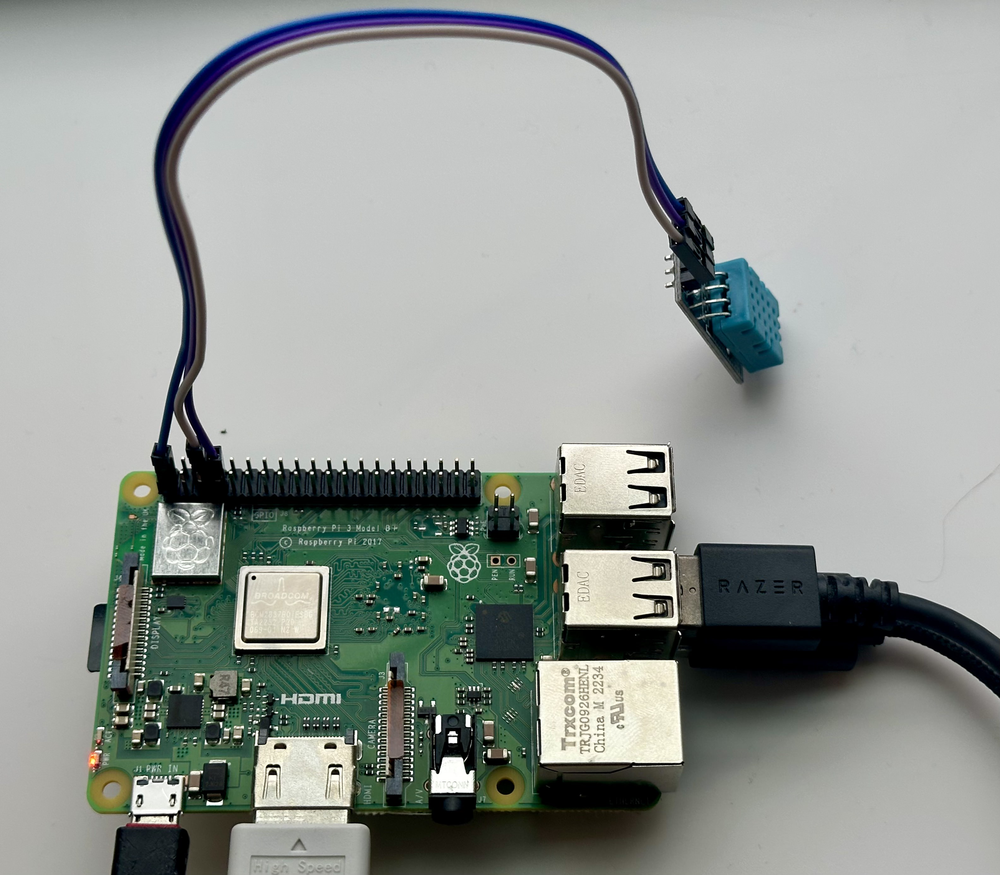
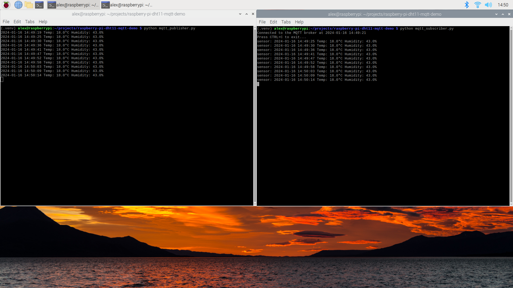

# Raspberry Pi DHT11 MQTT Demo

This is a simple project to read temperature and humidity from a DHT11 sensor and send it to an MQTT broker. The MQTT broker is running on a Raspberry Pi 3B+.

I made this project to gain experience configuring, running code, and interfacing with peripherals (such as a DHT11 sensor) on lightweight computers (such as a Raspberry Pi). I also wanted to learn how to use MQTT to send data from a device to a server.

Currently, the both publisher and sole subscriber in this project are running on the same Raspberry Pi. In the future, I plan to publish MQTT messages to a subscriber in the cloud so that the temperature and humidity data can be stored in a cloud database. I also plan to add a web interface to display the temperature and humidity data over time.

## Table of Contents

- [Raspberry Pi DHT11 MQTT Demo](#raspberry-pi-dht11-mqtt-demo)
  - [Table of Contents](#table-of-contents)
  - [Hardware](#hardware)
  - [Software](#software)
  - [Installation](#installation)
    - [Hardware](#hardware-1)
      - [Connecting the DHT11 sensor to the Raspberry Pi](#connecting-the-dht11-sensor-to-the-raspberry-pi)
    - [Software](#software-1)
      - [Python 3.9.2](#python-392)
      - [Eclipse Mosquitto](#eclipse-mosquitto)
      - [Creating a virtual environment](#creating-a-virtual-environment)
      - [Installing dependencies](#installing-dependencies)
  - [Usage](#usage)
  - [Future Work](#future-work)
  - [Acknowledgements](#acknowledgements)

## Hardware

- Raspberry Pi 3B+
- DHT11 sensor with a breakout board
- 3 jumper wires

I got my DHT11 with a breakoutboard and jumper wires from [here](https://www.amazon.com/BOJACK-Temperature-Humidity-Digital-Raspberry/dp/B09TKTZMSL).



## Software

- Python 3.9.2
- Eclipse Mosquitto 2.0.11 (MQTT broker)

This project is intended to be run on a Raspberry Pi 3B+ running Raspberry Pi OS. I used the Raspberry Pi Imager to install Raspberry Pi OS on my Raspberry Pi 3B+.

## Installation

### Hardware

#### Connecting the DHT11 sensor to the Raspberry Pi

I used a DHT11 sensor with a breakout board. The breakout board has 3 pins: VCC, DATA and GROUND, marked with +, out, and - respectively. Each pin is connected to a pin on the Raspberry Pi by a jumper wire: the VCC pin is connected to the 3.3V pin, the GROUND pin is connected to a GND pin, and the DATA pin is connected to any available GPIO pin. I used the following connections:

- VCC to pin 1 (3.3V)
- GROUND to pin 6 (GND)
- DATA to pin 7 (GPIO 4)

### Software

#### Python 3.9.2

I used Python 3.9.2 for this project. To install Python 3.9.2, use the following command:

```bash
sudo apt install python3.9
```

#### Eclipse Mosquitto

Eclipse Moquitto is an open source MQTT broker. I used Eclipse Mosquitto 2.0.11 for this project. To install Eclipse Mosquitto 2.0.11, use the following command:

```bash
sudo apt install mosquitto
```

#### Creating a virtual environment

I used a virtual environment to manage the dependencies for this project. To create a virtual environment, I used the following commands:

```bash
python3 -m venv .venv
source .venv/bin/activate
```

The .venv directory is where the virtual environment is stored. It is ignored by git since it is included in the .gitignore file. The second command activates the virtual environment. To deactivate the virtual environment, use the following command:

```bash
deactivate
```

#### Installing dependencies

To install the dependencies for this project, use the following command:

```bash
pip install -r requirements.txt
```

## Usage

To test if the DHT11 sensor is working, run the Sensor.py script:

```bash
python Sensor.py
```

The script will print the temperature and humidity to the console. If the script is not working, check the connections between the DHT11 sensor and the Raspberry Pi.

To start the MQTT publisher, use the following command:

```bash
python mqtt_publisher.py
```

The MQTT publisher will publish the temperature and humidity to the MQTT broker every 5 seconds. Use Ctrl-C to stop the MQTT publisher.

To start the MQTT subscriber, use the following command:

```bash
python mqtt_subscriber.py
```

The MQTT subscriber will subscribe to the topic "sensor" and print the temperature and humidity to the console. Use Ctrl-C to stop the MQTT subscriber.

Run these scripts in separate terminal windows to see the MQTT publisher and subscriber in action:



## Future Work

### Add a cloud database to store the temperature and humidity data

I plan to add a cloud database to store the temperature and humidity data. I'm condsidering using AWS IoT Core to send the data to a Lambda function that would store the data in an Amazon RDS database.

### Add a web interface to display the temperature and humidity data

Once a cloud database is set up, I plan to add a web interface to display the temperature and humidity data. I'm considering using AWS API Gateway and AWS Lambda to create a REST API to retrieve the data from the database. I would then use React to create a web interface to display the data.

### Testing suite and CI/CD pipeline

Right now, when I make changes to the code, I have to manually pull the changes from GitHub to the Raspberry Pi and test the changes. To accelerate this process, I plan to set up a CI/CD pipeline to automatically pull the changes from GitHub to the Raspberry Pi. I also plan to create a testing suite to test the code before it is deployed to the Raspberry Pi.

## Acknowledgements

- [Adafruit DHT Python Library](https://github.com/adafruit/Adafruit_Python_DHT)
- [paho-mqtt](https://pypi.org/project/paho-mqtt/)
- [Eclipse Mosquitto](https://mosquitto.org/)
- [Raspberry Pi](https://www.raspberrypi.org/)
- [DHT11 sensor](https://www.amazon.com/BOJACK-Temperature-Humidity-Digital-Raspberry/dp/B09TKTZMSL)
- [PiddlerInTheRoot's DHT11 tutorial for hardware setup](https://www.youtube.com/watch?v=KUr8WgSIsfk&t=209s&ab_channel=PiddlerInTheRoot)
- [KitFlix's DHT11 tutorial for Adafruit_DHT usage](https://www.youtube.com/watch?v=WUoCCQmxxEk&t=534s&ab_channel=Kitflix)
- [Anastasia Potekhina's MQTT tutorial](https://medium.com/@potekh.anastasia/a-beginners-guide-to-mqtt-understanding-mqtt-mosquitto-broker-and-paho-python-mqtt-client-990822274923)
